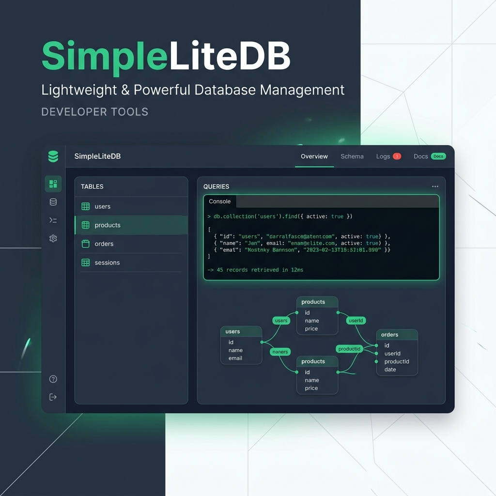

# SimpleLiteDB 🚀
### Lightweight & Powerful SQLite over HTTP Management Suite

SimpleLiteDB is a comprehensive web-based management tool and HTTP API service for SQLite databases. It provides a professional, developer-friendly interface to manage your data, schemas, and relationships with ease.



## ✨ Core Features

- **🌐 Web-Based Dashboard**: A sleek, modern, and responsive UI for managing all your SQLite databases in one place.
- **🖥️ Integrated Terminal**: A powerful web terminal with context-aware commands (`USE`, `LIST DATABASES`, `DESC`, etc.) and full SQL support.
- **🛠️ Advanced Schema Editor**:
  - Rename columns and change data types on the fly.
  - Interactive reordering (Up/Down) of columns.
  - Safe table migration using automatic temporary table rebuilding.
- **🗺️ Interactive Schema Map**: 
  - Visualize table relationships (Foreign Keys) with Mermaid.js.
  - Interactive **Pan & Zoom** for exploring complex schemas.
- **📊 Rich Data Grid**: 
  - Detailed column headers showing Types, Primary Keys, and Nullable status.
  - Inline row editing and deletion.
  - Smart `INSERT` handling for auto-incrementing fields.
- **🔌 HTTP API & Auto-Docs**: 
  - Every database is accessible via a secure HTTP POST `/query` endpoint.
  - Built-in API documentation with code snippets for various languages.
- **🔒 Security**: Independent API Keys for each database to ensure isolated and secure access.

## 🚀 Quick Start

1. **Initialize the Service**:
   ```bash
   ./slite init
   ```

2. **Start the Database Server**:
   ```bash
   ./slite start db
   ```

3. **Open the Dashboard**:
   Visit `http://YOUR_VPS_IP:5117/dashboard` in your browser.

## 🛠️ CLI Management

The `./slite` tool provides several administrative commands:

| Command | Description |
| :--- | :--- |
| `init` | Setup VENV, install dependencies, and firewall |
| `create db` | Create a new database and generate an API key |
| `list db` | List all databases and their file sizes |
| `refresh [name]` | Empty/reset a specific database |
| `delete [name]` | Delete a database and its associated API key |
| `start db` | Start the service in the background |
| `stop db` | Stop the background service |
| `update` | Stop, Pull latest changes from Git, and Restart |
| `log` | View live service logs |

## 📦 Tech Stack

- **Backend**: Python (FastAPI, SQLite3)
- **Frontend**: Vanilla JS, TailwindCSS (for rapid premium styling), Mermaid.js
- **Visualization**: svg-pan-zoom

---
Developed with ❤️ for developers who love simplicity and power.
